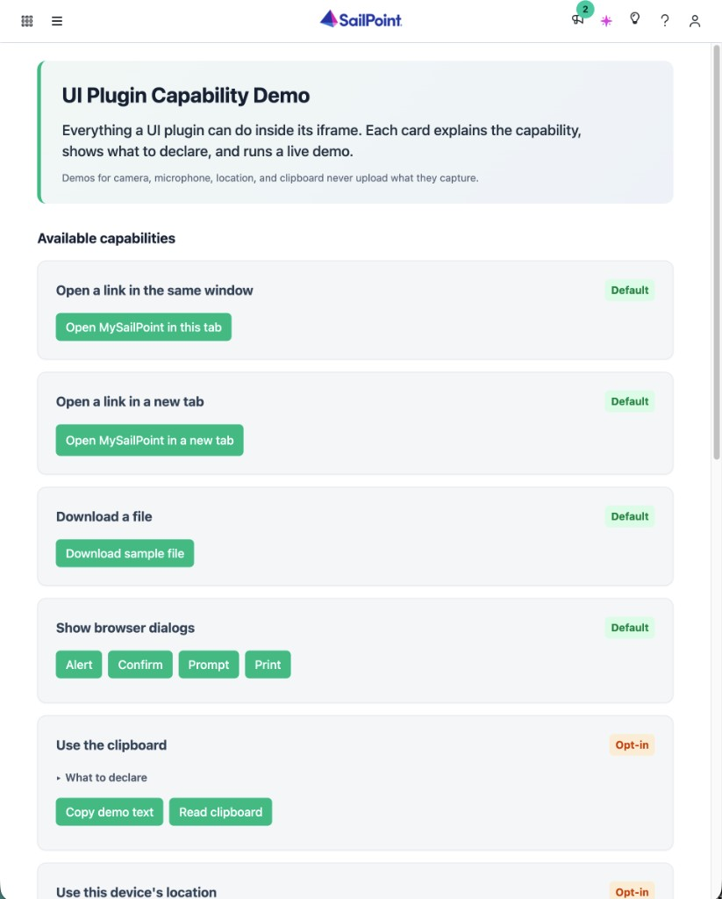

# UI Plugin Capability Demo

A SailPoint Identity Security UI plugin that shows what a plugin can do from inside its iframe. Each card names a capability, shows the `iframeAllow` and `permissionPolicy` values you declare to enable it, and gives you a button to run it live.



## What to expect

Every card should succeed once you grant the browser permission it asks for.

The project demonstrates these capabilities:
- **Open a link in the same window** (`allow-top-navigation`)
- **Open a link in a new tab** (`allow-popups`)
- **Download a file** (`allow-downloads`)
- **Show browser dialogs** (`allow-modals`)
- **Read from the clipboard** (`clipboard-read`)
- **Write to the clipboard** (`clipboard-write`)
- **Request geolocation** (`geolocation`)
- **Request camera** (`camera`)
- **Request microphone** (`microphone`)
- **Request device sensors** (`gyroscope`, `accelerometer`, `magnetometer`)
- **Request fullscreen** (`fullscreen`)

## Prerequisites

- Node.js (matches Angular 21 requirements)
- [SailPoint CLI](https://developer.sailpoint.com/docs/tools/cli) installed and configured
- HTTPS trust for `ng serve --ssl` (needed for `npm start`)

## Getting started

Run these in order:

```bash
npm install                 # install dependencies
npm test                    # run unit tests
npm run build               # compile the plugin
sail ui-plugins create      # first time only; later: sail ui-plugins push-manifest
sail ui-plugins upload      # upload the build to your tenant
```

Open the plugin in Identity Security Cloud as a normal installed plugin.

## Making changes

To iterate on the plugin in your tenant without uploading a build each time:

```bash
sail ui-plugins link        # point your identity at this server
npm start                   # local HTTPS server on port 4200 (keeps running)
```

Open Identity Security Cloud with `?spPluginDev=capability-demo`. The host loads this local server inside the live tenant.
