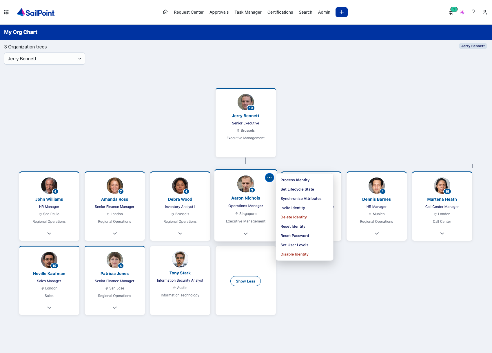
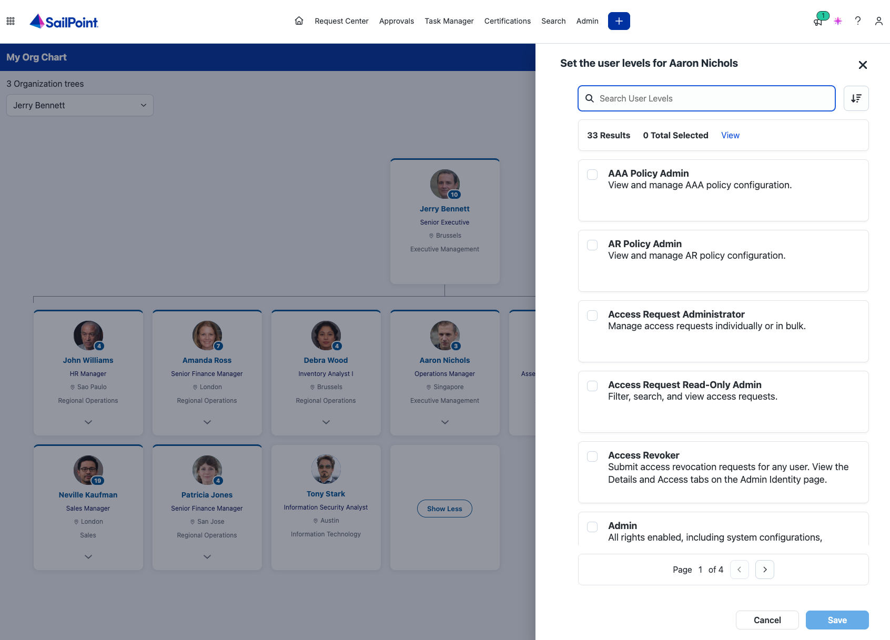
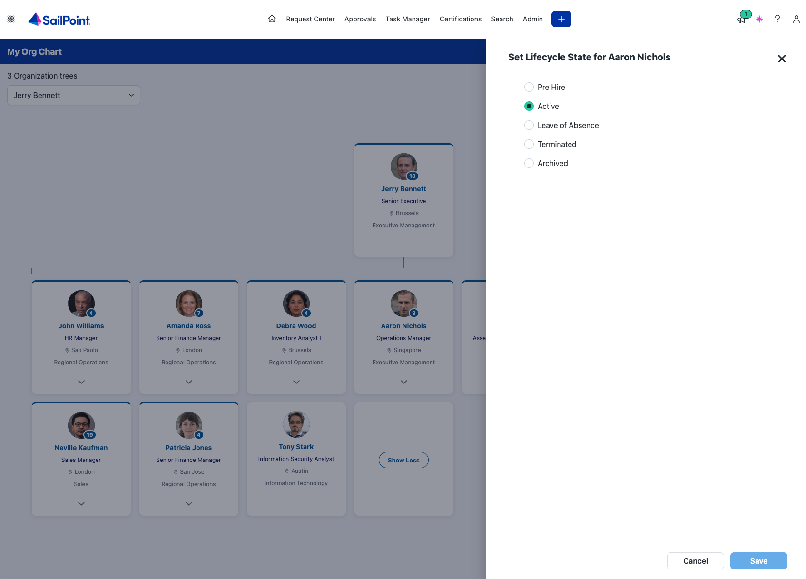

# ISC Org Chart

By Cristian Grau <cristian.grau@sailpoint.com>

A SailPoint **Identity Security Cloud (ISC)** UI plugin built on
`[@sailpoint/ui-plugin-sdk](https://www.npmjs.com/package/@sailpoint/ui-plugin-sdk)`.

It renders a single full-page focused org navigator: one focused person
centre-stage, an up-chevron to their manager, a breadcrumb of ancestors, and
their direct reports as cards you click to re-focus. The hierarchy comes from
`POST /v3/search` against the identity index, and the page opens focused on the
logged-in user from the **context** the ISC **App Shell** hands over
`postMessage`.

## What it looks like

Running inside ISC, in a demo tenant whose identities and photos are generated.



*The focused person centre-stage, their reports below — a row too wide for the
frame stacks behind a Show More toggle — and the ··· menu on a card, carrying
the same Related Actions ISC offers on its identity list.*



*Set User Levels: the levels the tenant can assign, searchable, sortable and
paged ten at a time, with what each one grants.*



*Set Lifecycle State: the states enabled on the identity's profile, in the order
the lifecycle runs rather than alphabetically.*

## How it runs in two modes

A plugin is normally embedded by ISC as an iframe, with the App Shell as its
parent window. This page detects its situation with `window.parent === window`:

- **Standalone** (opened directly / hosted for a demo) → there is no App Shell,
so it installs the SDK's **mock App Shell** (`@sailpoint/ui-plugin-sdk/testing`)
and renders offline with a default least-privileged user.
- **Embedded in ISC** → it performs the real handshake against the App Shell.

The same build serves both; no code change to deploy into ISC.

## Commands

```bash
npm install
npm run dev       # local dev server (standalone/demo mode)
npm test          # offline unit tests against the mock App Shell
npm run build     # type-check + bundle static site to dist/
npm run preview   # serve the built dist/ locally
```

Requires Node 22+.

## What to look at

- `src/main.ts` — boot, mode detection, `getContext()`, paged identity search.
- `src/org-nav.ts` — the pure navigation model (index, ancestors, reports).
- `src/org-view.ts` — the navigator DOM, cards, and Related Actions menu.
- `test/plugin.test.ts` — offline tests: context handshake, tenant override,
host viewport events.


## Managing plugins with the SailPoint CLI

Registering, dev-linking, and deploying an ISC UI plugin is done entirely from
the command line with the **SailPoint CLI** (`sail`). There is no screen in the
tenant for creating a plugin.

### 0. Install the CLI

Full guide: [Start using the CLI](https://developer.sailpoint.com/docs/tools/cli/#start-using-the-cli).

```bash
# macOS
brew tap sailpoint-oss/tap && brew install sailpoint-cli

# Linux (.deb / .rpm from the releases page)
sudo apt install ./sail_x.x.x_linux_amd64.deb

# Windows: run the sail_x.x.x_windows_amd64.msi installer
```

Releases: [https://github.com/sailpoint-oss/sailpoint-cli/releases](https://github.com/sailpoint-oss/sailpoint-cli/releases)

> **Requires CLI 2.4.0 or newer.** The `ui-plugins` command group shipped in
> [2.4.0](https://github.com/sailpoint-oss/sailpoint-cli/releases/tag/2.4.0) and
> does not exist in 2.3.0 or earlier — no env var will reveal it there. Check
> `sail --version`, and `brew upgrade sailpoint-cli` if `sail ui-plugins --help`
> still reports `unknown command` after step 1.


### 1. Enable the experimental plugin commands

The `ui-plugins` group is experimental and gated behind a feature flag. Export it
in every shell where you run plugin commands:

```bash
export SAIL_EXPERIMENTAL_UI_PLUGINS=1
```

Put it in your `~/.zshrc` / `~/.bashrc` so you don't have to remember it.

Two things to know about the flag: it gates **execution**, not help — running a
subcommand without it fails with

```
Error: the `sail ui-plugins` command group is experimental and currently
disabled. Enable it with `SAIL_EXPERIMENTAL_UI_PLUGINS=1`
```

while `sail ui-plugins --help` prints normally either way. And the group stays
hidden from the top-level `sail --help` listing *even with the flag set*, so
don't take its absence there as a sign the flag isn't working — check
`sail --version` instead.

### 2. Create a CLI environment and authenticate

An *environment* is a named tenant profile the CLI stores locally.

```bash
sail environment create {environment-name}
```

It prompts for a tenant name, a tenant URL, and an API URL. Omit the name
argument and the CLI names the environment after your tenant.

**Production tenants** (`identitynow.com`) are the default the CLI is built
around, and both URLs follow the same pattern:


| Prompt                                  | Value                                  |
| --------------------------------------- | -------------------------------------- |
| **Tenant URL** — where you log into ISC | `https://<tenant>.identitynow.com`     |
| **API URL** — the tenant's API base URL | `https://<tenant>.api.identitynow.com` |


Then choose an auth method. **PAT is usually the better choice**, especially for
dev tenants:

```bash
sail set pat                 # prompts for Client ID + Client Secret
sail set auth pat
# or, for browser-based login:
sail set auth oauth          # the CLI default
```

For CI, skip the interactive config and set `SAIL_BASE_URL`, `SAIL_CLIENT_ID`,
and `SAIL_CLIENT_SECRET` instead.

Managing environments — note that `update` is how you fix an environment you
already created rather than deleting and re-adding it (all of these are
interactive; none take value flags):

```bash
sail environment list            # all configured environments
sail environment show            # view the active one
sail environment use {name}      # switch active tenant
sail environment update {name}   # correct the URLs of an existing environment
sail environment delete          # delete the active environment
```

The config lives in `~/.sailpoint/config.yaml` if you prefer to edit `baseurl` /
`tenanturl` directly.

Authentication is required from step 3 onward — `init` validates the alias
against your tenant and fails fast if no authenticated client is available.

### 3. Scaffold or attach a plugin workspace

`init` has two flows on one command.

**New workspace** (default) — scaffolds a new **Angular** plugin workspace from
the SailPoint templates into a directory named after the alias:

```bash
sail ui-plugins init "My Plugin" --alias my-plugin
cd my-plugin
npm install
```

**Existing project** (`--path`) — makes a project you already have SDK-ready by
generating a valid `sp-ui-plugin.json` and dropping in the plugin guide, without
touching unrelated files. This is the flow for **this repo**, which is a Vite +
TypeScript project rather than an Angular one:

```bash
sail ui-plugins init "ISC Org Chart" \
  --path . --out-dir ./dist --port 5173 --alias isc-org-chart
```


| Flag                     | Meaning                                                                                      |
| ------------------------ | -------------------------------------------------------------------------------------------- |
| `--name` (or positional) | Display name. Supplying it skips the interactive prompts.                                    |
| `--alias`                | Tenant-unique key; defaults to a slug of the name. Validated against the tenant immediately. |
| `--path`                 | Attach an existing project instead of scaffolding a new one.                                 |
| `--out-dir`              | Build output directory (required with `--path`). `dist` for this repo.                       |
| `--port`                 | Local dev server port (required with `--path`, default `4200`). Vite serves on `5173`.       |
| `--force`                | Overwrite the plugin files `init` manages if they already exist.                             |


`init` does **not** install dependencies, build, or register the plugin, and it
does not touch your `package.json` dependencies. Run `npm install` and
`sail ui-plugins create` yourself afterwards.

#### The workspace manifest

`init` writes `sp-ui-plugin.json`, which every later command reads. It has two
parts:

- `manifest` — what gets sent to the tenant: slots, capabilities, and the
required policy objects `contentSecurityPolicies`, `permissionPolicy`, and
`iframeAllow`.
- `build` — local-only settings (`build.outDir`, `build.port`). This section
is **never transmitted**.

Check it without contacting the tenant at any time:

```bash
sail ui-plugins validate-manifest    # alias: validate
```

This is a structural check only — JSON shape, required fields, strict rejection
of unknown fields, config schema version, and the presence of the policy objects
(an empty `{}` is accepted). It does **not** verify alias availability, slot
registry membership, CSP directive values, or capability lists; only `create`
and `push-manifest` get you full backend validation.

### 4. Register the plugin with your tenant

```bash
sail ui-plugins create --private
```

Registers a plugin instance in the tenant your CLI is currently authenticated
against, from `./sp-ui-plugin.json`. The alias becomes the instance identifier,
and an alias already in use is reported as a conflict. On success it prints the
plugin **instance ID**.

Visibility overrides — both apply per slot and **replace** any `restrictToUsers`
declared in the manifest:


| Flag                  | Effect                                                                                                       |
| --------------------- | ------------------------------------------------------------------------------------------------------------ |
| `--private`           | Adds *your own* identity (resolved from the active token) to every slot — the plugin is visible only to you. |
| `--restrict-to-users` | Adds the given identity GUIDs (comma-separated) to every slot.                                               |


Supplying both gives each slot the de-duplicated union of the two.

```bash
sail ui-plugins create --dry-run   # validate + print the exact payload, create nothing
sail ui-plugins create --json      # raw UMS response, including devDocumentHeaders
```

> **Dev CSP headers.** On a successful create (and again on `link`), the backend
> returns `devDocumentHeaders`, and the CLI writes the `Content-Security-Policy`
> and `Permissions-Policy` values into `angular.json` under
> `projects.<alias>.architect.serve.options.headers`. **This repo has no**
> `angular.json` — the CLI prints a note and succeeds, but nothing is patched,
> so set those two headers yourself under `server.headers` in `vite.config.ts`.
> Restart the dev server whenever they change.


### 5. Link your local dev server

```bash
sail ui-plugins link
npm run dev        # scaffolded Angular workspaces use `npm start`
```

`link` binds your local dev server port to **your own identity** on the plugin
instance. It is a per-developer override: it does not affect other developers or
the plugin's deployed assets — only what *you* see. The port is resolved as
`--port` → `build.port` in `sp-ui-plugin.json` → `4200`.

```bash
sail ui-plugins link --port 5173   # override build.port
sail ui-plugins unlink             # inverse; idempotent, safe to run either way
```


### 6. Open the developer URL

`link` prints one fully qualified URL to **stdout** — you don't have to build it
by hand (informational messages go to stderr, so the URL pipes cleanly):

```
https://<tenant>/ui/plugin/<plugin-instance-id>?spPluginDev=<alias>
```

Open it in a browser. `sp-renderer` verifies the override with the tenant and,
if you're authorized, loads your local code in the live tenant with a local-dev
badge — real handshake, real tenant context, real session, with your edits
reloading live. The URL is stable across links; re-running `link` on a different
port updates the binding without changing it.

### 7. Deploy

Build with your own tooling first — `upload` never builds for you:

```bash
npm run build                  # produces dist/
sail ui-plugins upload         # deploys build.outDir (or --out-dir ./dist)
```

Uploaded assets are hosted immutably behind the CDN and become the instance's
active asset bundle. Because the alias is the lookup key, the identical command
deploys to whichever tenant you're currently authenticated against — switch
environments with `sail environment use` and re-run to promote staging to prod,
with no environment-specific GUIDs tracked locally.

To ship configuration changes without re-uploading assets:

```bash
sail ui-plugins push-manifest    # alias: update — takes the same --private / --dry-run flags
```


### Command reference


| Command                          | Purpose                                                                              |
| -------------------------------- | ------------------------------------------------------------------------------------ |
| `init`                           | Scaffold a new workspace, or attach an existing project with `--path`.               |
| `validate-manifest` (`validate`) | Offline structural check of `sp-ui-plugin.json`.                                     |
| `create`                         | Register the instance in the tenant from the manifest.                               |
| `link` / `unlink`                | Add / remove your personal local-dev override.                                       |
| `upload`                         | Deploy compiled assets from the build output directory.                              |
| `push-manifest` (`update`)       | Deploy manifest/config changes only.                                                 |
| `list`                           | Table of the tenant's instances (Alias, Id, Name, Created); `--json` for raw output. |
| `enable` / `disable`             | Turn an instance on or off, by alias or plugin ID.                                   |
| `delete`                         | Remove an instance permanently.                                                      |


`enable`, `disable`, and `delete` take either an alias or a plugin ID and detect
which by shape — a UUID-form value is always read as a plugin ID. `disable` and
`delete` print a summary (with a warning if a live asset bundle exists) and
prompt for confirmation, defaulting to No; `--force` / `-F` skips the prompt but
not the safety checks. All of them accept `--json`.

## Notes on running inside real ISC

Once `upload` has deployed `dist/`, SailPoint hosts the assets behind its CDN and
the App Shell embeds them — you do not host the bundle yourself. The real
handshake replaces the mock automatically, with no code change, because
`src/main.ts` decides which mode to use at runtime.

The security policies that govern the embed live in the `manifest` section of
`sp-ui-plugin.json` — `contentSecurityPolicies`, `permissionPolicy`, and
`iframeAllow`. Edit them there and ship with `push-manifest`; `validate-manifest`
only confirms the objects are present, so directive names and values are checked
by the backend on `create` / `push-manifest`.
## What each viewer sees

The plugin is open to every signed-in user, but the tenant APIs behind it are
not, so the view adapts to the capabilities the App Shell reports
(`context.user.capabilities`). An admin, here, means Org Admin or Helpdesk
Admin.

| | Admin | Everyone else |
| --- | --- | --- |
| Hierarchy | `POST /v3/search` (every attribute) | `GET /v3/public-identities` (the attributes the public identity config exposes) |
| Card links to the identity page | yes | no — it is an admin screen |
| Related Actions (`···`) | yes | no — the APIs behind them are admin-only |
| Tree picker | yes | no — one hierarchy, the one they are part of |
| Photos | account scan, plus any promoted to the identity | only those promoted to the identity |

### Photos

`src/photos.ts` reads photos from accounts — every source whose account schema
declares `profilePhoto`, `thumbnailPhoto`, `jpegPhoto` or `photo`. That needs
`/v3/sources` and `/v3/accounts`, both admin-only, so it produces nothing at all
for an ordinary user.

To give everyone faces, promote the photo onto the identity itself and expose it
through the public identity config. On a tenant whose HR source carries the
photo:

```bash
# 1. Declare the identity attribute.
sail api post /beta/identity-attributes --body '{
  "name": "profilePhoto", "displayName": "Profile Photo", "type": "string",
  "standard": false, "multi": false, "searchable": false, "system": false,
  "sources": [{"type": "rule", "properties": {
    "ruleType": "IdentityAttribute", "ruleName": "Cloud Promote Identity Attribute"}}]
}'

# 2. Map it from the account attribute, in the identity profile that owns those
#    accounts (SOURCE_ID and the profile id are yours).
sail api patch /v3/identity-profiles/PROFILE_ID -c application/json-patch+json --body '[
  {"op": "add", "path": "/identityAttributeConfig/attributeTransforms/-", "value": {
    "identityAttributeName": "profilePhoto",
    "transformDefinition": {"type": "accountAttribute", "attributes": {
      "sourceName": "HR", "attributeName": "profilePhoto", "sourceId": "SOURCE_ID"}}}}
]'

# 3. Re-process the identities so the value lands (or wait for an aggregation).
#    Batch it — the endpoint takes a list — and it needs the experimental header.
sail api post /identities/v1/process -H 'X-SailPoint-Experimental: true' \
  --body '{"identityIds": ["..."]}'

# 4. Expose it publicly. Send the whole list; this replaces it. Max 5.
sail api put /beta/public-identities-config --body '{"attributes": [
  {"key": "jobTitle", "name": "Job Title"},
  {"key": "location", "name": "Location"},
  {"key": "department", "name": "Department"},
  {"key": "profilePhoto", "name": "Profile Photo"}
]}'
```

`toOrgIdentity` then picks the photo up from the identity document under any of
those four attribute names, on both the admin and the public path — no code
change per tenant. Base64 of 5–10KB per person survives the round trip intact,
but it is sent with every identity in every page of 250, so expect the payload
to grow with how many people have one.

Photos are painted onto a `<canvas>`, not an ``: the plugin CSP is
`img-src 'self'` and UMS refuses to widen it, while `createImageBitmap` on an
in-memory Blob is not subject to that directive.
