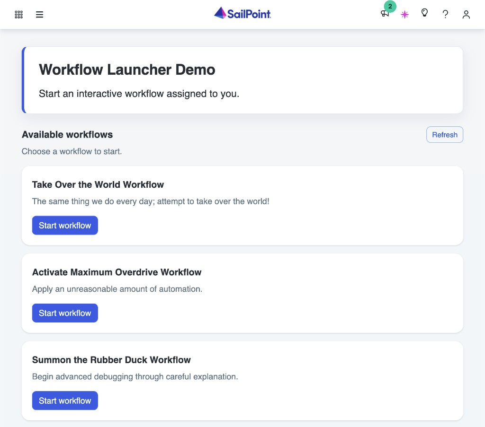

# Workflow Launcher Demo

A SailPoint Identity Security Cloud UI plugin that starts an interactive workflow assigned to you. No client IDs or secrets are stored in the plugin.



## What to expect

The plugin lists **Available workflows** and asks you to choose one to start.

- **Start workflow** starts that workflow. On success it says **Workflow started** and links to **Open in Launchpad**. Interactive steps open there, not in this iframe.
- **Refresh** reloads the list.
- If nothing is assigned, the plugin says **No workflows are assigned to you**.

Before the list can show anything:

1. Create a workflow with an **Interactive Trigger**, add a launcher, and enable the workflow.
2. Grant that launcher's entitlement to the user who will open the plugin.

## Prerequisites

- Node.js (matches Angular 21 requirements)
- [SailPoint CLI](https://developer.sailpoint.com/docs/tools/cli) installed and configured
- HTTPS trust for `ng serve --ssl` (needed for `npm start`)

## Getting started

Run these in order:

```bash
npm install                 # install dependencies
npm test                    # run unit tests
npm run build               # compile the plugin
sail ui-plugins create      # first time only; later: sail ui-plugins push-manifest
sail ui-plugins upload      # upload the build to your tenant
```

Open the plugin in Identity Security Cloud as a normal installed plugin.

## Making changes

To iterate on the plugin in your tenant without uploading a build each time:

```bash
sail ui-plugins link        # point your identity at this server
npm start                   # local HTTPS server on port 4200 (keeps running)
```

Open Identity Security Cloud with `?spPluginDev=workflow-launcher-demo`. The host loads this local server inside the live tenant.
